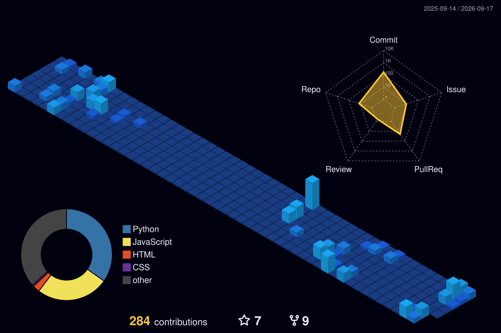

<h1 align="center"><b>HELLO EVERYONE</b></h1>

<div align="center">
  <a href="https://git.io/typing-svg">
    
  </a>
</div>

<br>


<div align="left">
  
</div>

<h3>Hey, I'm Keron! ⚡</h3>


<p>A 24-year-old Computer Engineering undergrad turning coffee into code and manual tasks into automated magic.</p>

- 🔭 **Focusing on:** Building seamless Automation tools
- 🌱 **Diving deep into:** Machine Learning and data models 🤖
- 🤝 **Open for:** Exciting new projects—let's build something awesome together!
- 😄 **Pronouns:** He/Him
- 🕹️ **When I'm not coding:** I'm either lost in an intense video game session 🎮 or chilling with a great playlist 🎧.

<br>
<h1 align="left"> 🔐 Security & Verification </h1>

<details>
<summary>
PGP Fingerprint:
<code>8004 7764 A30C 68BB D131 6374 139F AA58 ECE3 E174</code>
</summary>

```text
-----BEGIN PGP PUBLIC KEY BLOCK-----

mQINBGoxoXABEADFxDTyCbnrs/Z22VxP6kWq0bHb+rerj799BtoUH3UJgX3kwJWg
iHuDi5IpjAit4W3vQ6OgAaq+Hnb2wjE4wRaHs5zgXFGXHtxHOZkbYV54VlpnrPn1
oz+XdJTbwpNrX1KtllICjGR8ZS+rpezaj+yuJM2XpT5KUFZEgwRKQ4mcaSy+uhd9
1lqEX6ZWYs3kupTE/yV5Mb6TPpboGmEh3gxQJjiEYaiB1YCxezOUHdPKUq0ZNktS
FmOW6jbN7wn+mQCdwyP2Q6rVNKpuZpcPEpk3ntob/2MGaQIbBiXrLKSWnBR1CYDk
eXZSpIbtDqzEICJMtrc0ntUHQAlq2/3z3kVEOqmY4f1hFSybfVV9SZMuJwIatEdZ
8jdBFRDA5QbMUv97v7JWFLOB/Fbj8Sc8ZguEGlmaohP0pGtLkxMqIKs1PVd3zjkC
mwQi2jVbC/c93EYsYn1/TAPfreRAjN2+4ZwQM00c2axO2SDWS3yZIS4lBqX5750B
y0FDANKRK2s5KNTwGA35R0qsc2wp/LlAziLsYfFULk0Z0ZZuIVd26G7OtBoGSf5t
fKiDiQoBgNmudiJk8ylsBHmPe33RKgyUAjOwcbXlxm7Ewf7lClRPySLqxXAkFxZv
LdJ9c5hwpZNUZpBM1oFhQiVAC8ZefH/aQKv0gR18Hoq2wQUiaxWPIUta4wARAQAB
tCFLRVJaT1ggPGtlcm9ucGF0ZWw1NjU2QGdtYWlsLmNvbT6JAm0EEwEIAFcWIQSA
BHdkowxou9ExY3QTn6pY7OPhdAUCajGhcBsUgAAAAAAEAA5tYW51MiwyLjUrMS4x
MiwyLDECGwMFCwkIBwICIgIGFQoJCAsCBBYCAwECHgcCF4AACgkQE5+qWOzj4XQ7
1Q//X90UQx8spJYsIR0FcR86rs/rbSy7jPmHA7JhC4c1n5+OS3+GIy8GqN/r4wS5
YL7hfG0hp0OYvfWG68bhXrXD65RQeGzD9JssjtivwxbQo1lWm29FmSN7IwC7CpK/
+LFinkziiQN091ERbGEeKjZKWrzqHd0IV9UDRNTEzdg10+DHru6GwO12ovzziEgN
IDYFFejgbZRgw4D4P9E3VhTazfbGZD9lx2WB2vAIAa2LM0H2mXwb4gp5z0Rp7PgZ
+AyHvdI0OQRq5byJv389vx0Zx6RsVZWBRmx8vkwtZJBhe1CYV1PcQN00JfE3w+KU
n98iFhpBCw7eWCY/ITiGsbK6czftnLH2wibB8OL6B8GKaB76ia/NlFfCYhabAONV
vfFguql8ZO1/Ds1hcWnLC+AFjBanwCDw4bzsNoN6KRXf6q1CSQOLKqMuK+NSflDk
l7J/rXGhhT72+bDFsJdecxfw3v+tawCRGKPHLqwXvb9gKj3aI0Z8Ho1yHLtosW9c
7INU6lWEdxJnfbbJ67v6CGUqdhaq+ionUwX/flx6LFjtmI3JXEGd1EUi5HcKgeKG
BZWSRGG4o/J4Fz+NiwloL7E85pPwvdFpYirccvY5pEjrfDjLb4x6OHnpF4o8LOL0
R4pZ64yc6TegvEyMqLD1ETZLSUUqcVRQ7eRMNMTdyGKJEhy5Ag0EajGhcAEQAKD8
hj5mmAp7KtLY2qy0JL86pQ1/E2GZqyapVNCW/qXSyB2BywBGTMMZ5sgIyK7aKHs7
IP+lrTEk+3cwuLuAYi0e01uzUsOiHCtPTnDx0R43Yc6E3MOp078QbdViZVPp57cx
TtT7ZxKuaH5mzm5nHe0f9rfLcdmjbeR4lcClnYDt9rlCONzQJIcSIzWo5rm4UpdL
sS/uhZDITX857UU48DogFyb14dJZ8eNPPiJYLTXj3x/+aKZ0rFXfErpeQ17wjZo1
AvmG4AIb0gGEnJ7M6rT7dmqg8nVuduNcCrzd9hQez5OVPBBmlSfJ2LSQ2j62isjZ
btD+Msu0cdNef9s0T4KLPbTi5/sfyrAvEqh7Aql/pVMLcnLOTIF9eJxpu7Eihou+
oHR+DgE75uuBoWrKlkF63XCEqKI1tskDCr8deY1lCuRacTpVI+SHEkWGQCKMUESY
UI+hPC364rpl9x6/+INSEKT7D7sXN8BzcNlC3pvbfGH0anNNnrdRXIrKESBTkcXi
5E3KkVh53RLyeRRBX5CGQq3n5DAVI7jsMBnkOMhSIvI0z6VKWm5BfnVpDfadTa6V
r6v58iQPLF3WzbLxHj7aVfYlWUoAwgDDRC6YwXHLcfzD4WWdmalxzj5UnWsgetfJ
y5trOT4ley4HxO1VUqG2aLZ/P3yFnyFS7P02XWdPABEBAAGJAlIEGAEIADwWIQSA
BHdkowxou9ExY3QTn6pY7OPhdAUCajGhcBsUgAAAAAAEAA5tYW51MiwyLjUrMS4x
MiwyLDECGwwACgkQE5+qWOzj4XTpsBAApLYMgxkUYlfGgdvZJcOkaU+FMsUr4AjV
tvu56sQ60GcZLYKZwTrJtqrcHhH09Ba7u6da2qF/WeEpqQCCRtqYw89ZX4PNs64R
WGpXWVlH1YtuYcYo9wgpDhS+pKs6LIltl/zNPZBhpM9qoUN+2ctNyOAZm1NAtDJt
ZGnlU5toTNrWZU3ekJDqUgG7q31Rq37j2S0ZZECUeRpG8+YOUAc6eykO/p+bmYTH
xj1wieLwufp+PCHwVxA2UOKBZSJHVdRg9BEzT+ewTh2sFZorFgnUz+DFnwBFgTWA
jQP7ZkfrXZNAp1GWHNUVrSPDwrGiBE+/gWLhlIkqha+vCMz0U7UofMT0mJdg/wnS
WI9ggBMhRgesnCSBIzQK2r9t3IIlVcrCaZn73vQxuWjFuXTLi2wizSxIN23MVIcG
R/J6uglM5XWurfICxrsQcx+0URvMnUrMfsgZBi5wSOzI3vnmUSTjR6gH+sNsaYhA
arzbMtFzvO5eBdJ6BkH/RBEokHIxl3KCbvs4cWPFkE7UxrJiOUITNebjXk/P01iV
a9E1SWQ9Ua8GGtmVid5kd3U62cQrsd7HkUWixyT6SbDV+dMh7bLSZZe65aJ87lIg
pRSxvxivnGcLcgR8w7xz6u6BkSMubeAKUd57qq+PGbXNVIU5pbK0DrbIs0GZQAYG
37PPCcSbV/I=
=+Bp1


⠀⠀⠀⠀⠀⠀⠀⠀⠀⠀⠀⠀⠀⠀⠀⠀⠀⠀⠀⠀⠀⠀⠀⠀⠀⠀⠀⢀⠀⠊⠁⠈⢘⣒⣤⠠⠰⣤⣄⠀⠀⠀⠀⠀⠀⠀⠀⠀⠀⠀⠀⠀⠀⠀⠀⠀⠀⠀⠀⠀⠀⠀
⠀⠀⠀⠀⠀⠀⠀⠀⠀⠀⠀⠀⠀⠀⠀⠀⠀⠀⠀⠀⠀⠀⠀⠀⠀⢀⠐⠀⢀⠀⠀⢐⡩⡽⣿⣟⡄⠉⣻⣷⣦⡀⠀⠀⠀⠀⠀⠀⠀⠀⠀⠀⠀⠀⠀⠀⠀⠀⠀⠀⠀⠀
⠀⠀⠀⠀⠀⠀⠀⠀⠀⠀⠀⠀⠀⠀⠀⠀⠀⠀⠀⠀⠀⠀⠀⢀⢌⣴⡴⠊⣁⢔⣈⣰⡜⢉⣿⣿⡻⣤⣹⣿⣿⣷⣄⠀⠀⠀⠀⠀⠀⠀⠀⠀⠀⠀⠀⠀⠀⠀⠀⠀⠀⠀
⠀⠀⠀⠀⠀⠀⠀⠀⠀⠀⠀⠀⠀⠀⠀⠀⠀⠀⠀⠀⠀⠀⠠⣲⡿⢋⣤⣞⣵⣿⡟⣡⣔⣯⣿⣧⣯⣷⣿⣿⣿⣿⣿⣦⠐⠁⠀⠀⠀⠀⠀⠀⠀⠀⠀⠀⠀⠀⠀⠀⠀⠀
⠀⠀⠀⠀⠀⠀⠀⠀⠀⠀⠀⠀⠀⠀⠀⠀⠀⠀⠀⠀⠀⢠⣮⣞⣵⢿⣿⣿⣿⣷⣿⣿⣿⡿⢿⣿⣿⣿⣿⣿⣿⣿⣿⣿⣆⠀⠀⠀⠀⠀⠀⠀⠀⠀⠀⠀⠀⠀⠀⠀⠀⠀
⠀⠀⠀⠀⠀⠀⠀⠀⠀⠀⠀⠀⠀⠀⠀⠀⠀⠀⠀⠠⠐⢯⣿⣿⣿⣿⣿⣿⣿⣿⣿⡟⢡⠉⠜⣿⣿⣿⢻⣿⣿⣿⣿⣿⣿⡆⠀⠀⠀⠀⠀⠀⠀⠀⠀⠀⠀⠀⠀⠀⠀⠀
⠀⠀⠀⠀⠀⠀⠀⠀⠀⠀⠀⠀⠀⠀⠀⠀⠀⠀⠀⠀⡸⣾⣿⣿⣿⣿⣿⣿⣿⣿⠟⠀⠂⠀⢈⣿⣷⣿⠀⣿⢻⣿⣿⣿⣿⣧⠀⠀⠀⠀⠀⠀⠀⠀⠀⠀⠀⠀⠀⠀⠀⠀
⠀⠀⠀⠀⠀⠀⠀⠀⠀⠀⠀⠀⠀⠀⠀⠀⠀⠀⠀⠰⣿⣟⣻⣿⣿⣿⣿⣿⣿⣏⣀⠀⠀⠀⠸⣿⢿⡶⢀⡟⠈⣼⣿⣿⣿⣿⠀⠀⠀⠀⠀⠀⠀⠀⠀⠀⠀⠀⠀⠀⠀⠀
⠀⠀⠀⠀⠀⠀⠀⠀⠀⠀⠀⠀⠀⠀⠀⠀⠀⠀⢠⢃⣿⣭⣿⣿⣿⣿⣿⣿⡏⢍⣙⠛⠷⠦⡄⢻⣼⠋⣼⣁⣀⣹⣿⣿⣿⣿⠀⠀⠀⠀⠀⠀⠀⠀⠀⠀⠀⠀⠀⠀⠀⠀
⠀⠀⠀⠀⠀⠀⠀⠀⠀⠀⠀⠀⠀⠀⠀⠀⠀⠀⡎⢸⣿⣿⣿⣿⣿⣽⣿⠏⠻⠿⢿⣟⢦⢀⠀⠀⠉⠀⣉⣉⠉⢻⣿⣿⣿⣿⠇⠀⠀⠀⠀⠀⠀⠀⠀⠀⠀⠀⠀⠀⠀⠀
⠀⠀⠀⠀⠀⠀⠀⠀⠀⠀⠀⠀⠀⠀⠀⠀⠀⠀⠃⣸⣿⣿⣿⣿⣿⣿⡟⡈⠀⠀⠀⠀⢀⢮⠀⠀⠀⠚⡛⠃⠿⣾⣿⣿⣿⣿⠀⠀⠀⠀⠀⠀⠀⠀⠀⠀⠀⠀⠀⠀⠀⠀
⠀⠀⠀⠀⠀⠀⠀⠀⠀⠀⠀⠀⠀⠀⠀⠀⠀⣰⢳⣿⣿⣿⣿⣷⣿⣿⠱⠀⠁⠀⠀⠀⣨⠆⠃⠀⠀⠀⠀⠀⠀⢸⣿⣿⣿⢿⠀⠀⠀⠀⠀⠀⠀⠀⠀⠀⠀⠀⠀⠀⠀⠀
⠀⠀⠀⠀⠀⠀⠀⠀⠀⠀⠀⠀⠀⠀⠀⠀⢀⠃⢞⣿⣿⣿⣿⣿⣿⣟⠠⠁⠀⠀⠀⠘⠣⣼⠀⢀⠀⠀⠀⠀⠀⣼⣿⣿⣿⡻⠀⠀⠀⠀⠀⠀⠀⠀⠀⠀⠀⠀⠀⠀⠀⠀
⠀⠀⠀⠀⠀⠀⠀⠀⠀⠀⠀⠀⠀⠀⠀⠀⠀⢈⣼⣿⣿⣿⣿⣿⣿⣿⡄⠀⠀⠈⢷⣤⡤⢤⣠⣀⣀⠨⠀⠀⣰⣿⣿⣿⠏⡇⠀⠀⠀⠀⠀⠀⠀⠀⠀⠀⠀⠀⠀⠀⠀⠀
⠀⠀⠀⠀⠀⠀⠀⠀⠀⠀⠀⠀⠀⠀⠀⠰⠀⢼⡟⣽⣿⣿⣿⣿⣿⣿⣿⣆⢀⠀⠈⠱⠡⠔⠨⠎⠀⠀⣀⣼⣿⣿⣿⣻⠜⠀⠀⠀⠀⠀⠀⠀⠀⠀⠀⠀⠀⠀⠀⠀⠀⠀
⠀⠀⠀⠀⠀⠀⠀⠀⠀⠀⠀⠀⠀⠀⠄⠀⢠⣿⢱⣿⣿⣿⣿⣿⣿⣿⣿⡜⠛⣧⡀⠀⠀⠀⠀⢀⢠⣾⣿⣿⣿⣿⣿⣯⠀⠀⠀⠀⠀⠀⠀⠀⠀⠀⠀⠀⠀⠀⠀⠀⠀⠀
⠀⠀⠀⠀⠀⠀⠀⠀⠀⠀⠀⠀⠀⠀⠀⠀⢼⣥⡿⣼⣿⣿⣿⣿⣿⣿⣿⡇⠀⠀⠉⠒⠀⠐⠀⠀⢸⢿⣿⣿⣿⣿⣿⡤⠀⠀⠘⠀⠀⠀⠀⠀⠀⠀⠀⠀⠀⠀⠀⠀⠀⠀
⠀⠀⠀⠀⠀⠀⠀⠀⠀⠀⠀⠀⠀⠀⠀⠘⠸⣼⠇⢸⣿⣿⣿⣿⣿⣿⢾⣯⡀⠀⠀⠀⠀⠀⠀⠀⠈⢸⣿⣟⣻⢟⣫⠥⠧⠤⠤⡀⠁⠐⠄⢀⠀⠀⠀⠀⠀⠀⠀⠀⠀⠀
⠀⠀⠀⠀⠀⠀⠀⠀⠀⠀⠀⠀⠀⠀⡒⡀⠈⠻⡗⢹⣿⣿⣿⣿⣿⣿⣿⡇⣷⠀⠀⠀⠀⠀⣀⣀⣄⠾⠿⣷⠚⠉⠀⠘⡄⠣⠈⠔⠂⠀⠄⠀⠱⡄⠀⠀⠀⠀⠀⠀⠀⠀
⠀⠀⠀⠀⠀⠀⠀⠀⠀⠀⠀⠀⠐⠈⠀⠀⢠⣤⡁⠉⢿⠿⣿⣿⣿⣿⣿⡟⠉⠂⠀⡐⠢⠁⠀⠀⠀⠀⠀⢿⡆⠀⠀⠐⠀⠁⠀⠀⠀⠀⠀⠀⠀⠘⠆⠀⠀⠀⠀⠀⠀⠀
⠀⠀⠀⠀⠀⠀⠀⠀⠀⠔⢁⡠⠤⠄⠂⠉⢫⡏⢷⣶⣷⣿⣿⣿⣿⣿⣟⡇⠀⠀⠀⠀⠀⠀⠀⠀⠀⠀⠀⢫⣿⡀⠀⠀⠀⠀⠀⠀⠀⠀⠀⠀⠀⠀⢘⠀⠀⠀⠀⠀⠀⠀
⠀⠀⠀⠀⠀⠀⠀⠀⢊⡖⠉⠀⠀⠀⠀⠀⢈⢲⠾⢿⣿⣿⣿⣿⣿⢶⡚⢁⠀⠀⠀⠀⠀⠀⠀⠀⠀⠀⠀⠀⢹⣧⠀⠀⠀⠀⠀⠀⠀⠀⠀⠀⠀⠀⠀⡆⠀⠀⠀⠀⠀⠀
⠀⠀⠀⠀⠀⠀⠀⠈⣿⠠⠁⠀⠀⠀⠀⡀⠆⣤⠚⡉⢿⡿⢿⠿⠟⡉⠔⠠⠈⠀⠀⠀⠀⠀⢀⠠⠈⠄⡀⢀⠀⢿⣇⠀⠀⠀⠀⠀⠄⠀⠀⠀⠀⠀⠀⠘⠀⠀⠀⠀⠀⠀
⠀⠀⠀⠀⠀⠀⠀⠀⣏⠆⡀⠀⠀⢠⢰⡡⢂⠁⠠⢉⣿⠇⠆⡘⢠⠀⢂⠀⠀⠀⠀⠀⢀⡐⢢⠁⢎⡐⠄⠂⠀⠸⣿⣆⠀⠀⠀⠀⠈⠆⠀⠀⠀⠀⠀⠀⡆⠀⠀⠀⠀⠀
⠀⠀⠀⠀⠀⠀⠀⢰⣏⠒⠠⢄⠣⣞⡟⡔⣂⠒⣀⢾⣿⢈⠱⣀⠃⠜⡀⠢⢀⠀⠀⢀⠲⣘⠢⡉⠤⠐⡈⠄⠁⠀⢸⣿⣄⠀⠀⠀⠀⠰⠀⠀⠀⠀⠀⠀⡇⠀⠀⠀⠀⠀
⠀⠀⠀⠀⠀⠀⠀⣬⢧⠉⡒⣌⠳⣽⣟⣺⡴⠖⢫⠿⠇⡈⠐⠠⢈⠂⡐⠁⠂⠐⣀⢸⡳⢌⡁⠆⠁⢂⠀⠀⠀⠀⠈⣿⡿⣷⣄⠀⠀⠣⠀⠀⠀⠀⠀⠀⡇⠀⠀⠀⠀⠀
⠀⠀⠀⠀⠀⠀⠀⢸⣃⠆⡱⢎⡽⣺⣿⠋⢀⠠⢻⣠⠀⠈⠡⠄⠀⠄⠀⠀⠈⠀⢈⣿⢆⢃⡐⠈⠀⠀⠀⠀⠀⠀⠀⣿⣏⣿⡝⣷⡀⠀⠁⠀⠀⠀⠀⠀⠇⠀⠀⠀⠀⠀
⠀⠀⠀⠀⠀⠀⠀⢰⡇⢎⠵⣋⢶⡹⠁⠠⡀⢠⣻⣖⠀⠀⠀⠀⠀⠀⠀⠀⠀⠀⠀⣿⠎⡠⢀⠀⠀⠀⠀⠀⠀⠀⢠⣿⢺⡵⣛⠼⣋⢦⠀⠐⡀⠀⠀⠀⠄⠀⠀⠀⠀⠀
⠀⠀⠀⠀⠀⠀⠀⠸⡝⡬⢳⡍⡞⠁⣤⣇⣶⣷⣿⣿⡖⡀⠀⠀⠀⠀⠀⠀⠀⠀⠀⣿⠆⠡⠀⠀⠀⠀⠀⠀⠀⠀⢸⡧⣗⢮⡱⢫⡜⢦⢣⠀⠄⠀⠀⢀⠃⠀⠀⠀⠀⠀
⠀⠀⠀⠀⠀⠀⠀⠀⣟⡼⡱⢎⢇⣾⣿⣿⣿⣟⣧⣿⣷⠐⠀⠀⠀⠀⠀⠀⠀⠀⠀⢹⢎⠡⠀⠀⠀⠀⠀⠀⠀⢀⣿⢫⡜⢎⡱⢣⠜⣢⢃⢆⠀⠀⠀⢰⠀⠀⠀⠀⠀⠀
⠀⠀⠀⠀⠀⠀⠀⠀⢹⢶⡙⣾⣮⣿⣿⣿⣻⡾⣽⣛⣿⣇⠀⠀⠀⠀⠀⠀⠀⠀⠀⢸⡇⢂⠀⠀⠀⠀⠀⠀⢀⣾⢣⠣⡜⣌⠲⢡⠚⡄⢎⢸⠀⠀⠀⡜⠀⠀⠀⠀⠀⠀
⠀⠀⠀⠀⠀⠀⠀⠀⠨⡷⡹⣌⣿⣿⣿⣿⣷⣻⢧⡛⡼⢿⣧⡀⠀⠀⠀⠀⠀⠀⠀⢸⣇⠂⠀⠀⠀⠀⠀⢀⣼⢏⡲⢱⠘⡄⠣⢸⠇⡈⠔⡸⠀⠀⢀⠃⠀⠀⠀⠀⠀⠀
⠀⠀⠀⠀⠀⠀⠀⠀⠀⢷⣙⢦⣹⣿⣿⣿⣾⡽⢮⡕⡣⢍⣿⣧⡀⠀⠀⠀⠀⠀⠀⡌⠹⣧⡀⠀⠀⠀⢠⡾⣋⠎⡴⢁⠊⠄⡁⡾⠀⠐⢠⠁⠀⠀⣨⠀⠀⠀⠀⠀⠀⠀
⠀⠀⠀⠀⠀⠀⠀⠀⠀⠘⣭⠖⡌⢿⣿⣿⣿⡽⣧⡛⡴⢃⠆⡋⡿⣦⡀⠀⠀⠀⡐⠀⠀⠀⠓⣄⣠⣼⣿⡳⣍⠚⠤⡁⠌⣀⠞⠀⢀⠜⠁⠀⠀⢀⠇⠀⠀⠀⠀⠀⠀⠀
⠀⠀⠀⠀⠀⠀⠀⠀⠀⠀⢿⢌⠳⣈⠻⣟⣿⣿⣳⡽⣱⠍⡎⡔⡰⢨⢽⣷⣤⡼⠶⠖⠻⠛⠛⠋⠋⠺⣙⠻⠮⣏⣶⣼⣾⠭⠴⠒⠁⠀⠀⠀⠀⠘⠀⠀⠀⠀⠀⠀⠀⠀
⠀⠀⠀⠀⠀⠀⠀⠀⠀⠀⠸⣎⡓⠄⡂⠌⢻⣽⣟⣿⣷⡿⣴⣣⣷⠿⢛⠩⠊⠀⠀⠀⠀⠀⠀⠀⠀⠀⠀⠁⠀⠀⠀⠀⠀⠀⠀⠀⢸⡠⠀⠀⠀⡘⠀⠀⠀⠀⠀⠀⠀⠀
⠀⠀⠀⠀⠀⠀⠀⠀⠀⠀⠀⢷⡉⢆⠡⢊⠦⣽⣾⣻⣟⡿⡻⡕⡒⢌⡁⠂⠄⠀⠀⠀⠀⠀⠀⠀⠀⠀⠀⠀⠀⠀⠀⠀⠀⠀⠀⠀⡘⠀⠀⠀⢠⠃⠀⠀⠀⠀⠀⠀⠀⠀
⠀⠀⠀⠀⠀⠀⠀⠀⠀⠀⠀⠘⡵⢂⠑⢪⣽⣳⣿⣵⢾⣱⠓⣬⡱⢆⠈⠀⠀⠀⠀⠀⠀⠀⠀⠀⠀⠀⠀⠀⠀⠀⠀⠀⠀⠀⠀⢠⠁⠀⠀⢀⠆⠀⠀⠀⠀⠀⠀⠀⠀⠀
⠀⠁⠀⠀⠀⠀⠀⠀⠀⠀⠀⠀⢹⠦⢌⢣⡟⣿⣿⣿⣯⣇⠋⢶⡹⢀⠂⠀⠀⠀⠀⠀⠀⠀⠀⠀⠀⠀⠀⠀⠀⠀⠀⠀⠀⠀⠀⠰⠀⠀⢀⠎⠀⠀⠀⠀⠀⠀⠀⠀⠀⠀
⠀⠁⠀⠀⠀⠀⠀⠀⠀⠀⠀⠀⠀⠻⣆⠥⡚⡽⢯⡿⣷⣏⠞⡈⢗⡀⠀⠀⠀⠀⠀⠀⠀⠀⠀⠀⠀⠀⠀⠀⠀⠀⠀⠀⠀⠀⠀⠀⠃⢀⠎⠀⠀⠀⠀⠀⠀⠀⠀⠀⠀⠀
⠐⠀⠀⠀⠀⠀⠀⠀⠀⠀⠀⠀⠀⠀⠘⢧⡱⣩⠟⣽⣻⣞⣯⠀⠍⡄⠀⠀⠀⠀⠀⠀⠀⠀⠀⠀⠀⠀⠀⠀⠀⠀⠀⠀⠀⠀⠀⠀⠈⠪⠀⠀⠀⠀⠀⠀⠀⠀⠀⠀⠀⠀
⠐⠀⠀⠀⢀⠀⠀⠀⠀⠀⠀⠀⠀⠀⠀⠀⠙⢦⡛⣜⣳⣟⡦⣃⠐⡀⠆⡌⠀⢤⠀⠀⠀⠀⠀⠀⠀⠀⠀⠀⠀⠀⠀⠀⠀⠀⠀⠀⠀⠀⠙⢄⡀⠀⠀⠀⠀⠀⠀⠀⠀⠀
⠁⠄⠀⠀⠀⠀⠀⠀⠀⠀⠀⠀⠀⠀⠀⠀⠀⠈⠳⣬⢋⡟⢶⢁⢂⠘⡴⣈⠁⠀⠀⠀⠀⠀⠀⠀⠀⠀⠀⠀⠀⠀⠀⠀⠀⠀⠀⠀⠀⠀⠀⠈⠰⣀⠀⠀⠀⠀⠀⠀⠀⠀
⠌⡀⠀⡁⠀⢀⠀⠄⠀⠀⠀⠀⠀⠀⠀⠀⠀⠀⠀⣸⢼⡻⣌⠢⠀⠎⡵⢂⠡⠀⠀⠀⠀⠀⠈⣤⠀⠀⠀⠀⠀⠀⠀⠀⠀⠀⠀⠀⠀⠀⠀⠀⠀⠘⢢⠀⠀⠀⠀⠀⠀⠀
⠂⠄⠀⡀⠄⠀⢀⠀⠀⡀⠀⠀⠀⠀⠀⠀⠀⠀⡈⣷⣫⢕⠢⠄⡁⠎⡵⡉⠄⠀⠀⠀⠀⠀⢳⣿⠃⠀⠀⠀⠀⠀⠀⠀⠀⠀⠀⠀⠀⠀⠀⠀⠀⠀⠈⡆⠀⠀⠀⠀⠀⠀
⠌⠠⠐⠀⠀⠌⠀⠀⠀⠀⠐⠀⠀⠁⠀⠀⠀⠠⠁⣾⠵⡊⢅⠂⠄⠓⡬⢑⠠⠀⠀⠀⠀⠀⠈⠛⠀⠀⠀⠀⠀⠀⠀⠀⠀⠀⠀⠀⠀⠀⠀⠀⠀⠀⠀⠼⡀⠀⠀⠀⠀⠀
⢂⠁⠠⢈⠀⠐⠈⢀⠠⠀⠀⠀⡀⠀⠀⠀⠀⠃⣼⣏⠳⠉⡄⠌⡀⠣⡘⠄⢂⠀⠀⠀⠀⠀⠀⠀⠀⠀⠀⠀⠀⠀⠀⠀⠀⠀⠀⠀⠀⠀⠀⠀⠀⠀⢠⡿⠳⡀⠀⠀⠀⠀
⠂⠌⢀⠂⡀⢂⠠⠀⠀⡀⠐⠀⠀⠀⠀⠀⠀⢼⡷⢎⠆⠁⠀⢂⠁⢂⠱⠈⠄⠀⠀⠀⠀⠀⠀⠀⠀⠀⠀⠀⠀⠀⠀⠀⠀⠀⠀⠀⠀⠀⠀⠀⢀⣴⠿⠁⠀⢣⠀⠀⠀⠀
⠡⢈⠀⢂⠐⢀⠀⠁⠄⠀⠀⠄⠀⠈⠀⠀⢀⠹⣿⡆⠌⠀⠀⠈⢂⠄⠂⠡⠂⠀⠀⠀⠀⠀⠀⠀⠀⠀⠀⠀⠀⠀⠀⠀⠀⠀⠀⠀⠀⣀⢤⣎⠗⠋⠀⠀⠀⠀⠇⠀⠀⠀
⣁⠂⡐⢀⠂⠄⢈⠀⠄⠈⡀⠄⠐⠀⠀⠀⡌⣠⠻⢿⣷⣦⣀⠀⠂⠠⠀⡁⠂⠁⠀⠀⠀⠀⠀⠀⠀⠀⠀⠀⠀⠀⠀⠀⢀⣠⠤⡺⠭⠚⠁⠀⠀⠀⠀⠀⠀⠀⠡⡀⠀⠀
⠄⡂⠐⡀⢂⠈⠠⢀⠂⠐⡀⠐⠈⡀⠀⠀⣳⣯⣛⠤⡈⠙⠛⠻⠷⣶⣶⣤⣁⣂⡀⠀⠀⠀⠀⠀⠀⠀⠀⣀⣀⣠⣴⠲⣋⡔⠉⠀⠀⠀⠀⠀⠀⠀⠀⠀⠀⠀⠀⢡⠀⠀
⢂⠅⢂⠐⠠⢈⠐⡀⠈⠄⡐⠈⠠⠀⠀⢀⣼⣳⢭⠲⣁⠂⠄⠀⠀⠀⠀⠙⢿⣿⣻⢿⡳⣖⠶⣶⣛⣿⣙⠳⣩⢡⢢⣱⠎⢀⡠⠆⡀⠀⠀⠀⠀⠀⠀⠀⠀⠀⠀⢰⠀⠀
⡌⢂⠄⠌⡐⡀⠂⠄⠡⠀⠄⠡⠀⠁⠀⢀⢹⣧⢫⠱⣀⠊⢀⠀⠀⠀⠀⠤⡈⠹⢯⣿⣱⢏⡾⣰⡙⢦⢣⠓⡔⢢⣳⢃⡾⢋⠔⠠⠀⠀⠀⠀⠀⠀⠀⠀⠀⠀⠀⠈⡄⠀
⠆⡡⢈⠐⠠⢀⠡⠈⠄⠡⠈⠄⡁⠈⠀⠸⢸⣎⠧⢣⠐⡈⠀⠀⠀⠀⠀⠀⠈⠐⢌⡹⣟⣮⡳⣥⢫⢇⡏⠞⣌⣿⢷⠫⠜⡠⠈⠄⠀⠀⠀⠀⠀⠀⠀⠀⠀⠀⠀⠀⡇⠀
⠜⣀⠂⠌⡐⢀⠂⠡⠈⠄⡁⢂⠄⠡⠀⡇⡿⡼⣙⠦⡑⠄⡁⠀⠀⠀⠀⠀⠀⠀⠀⠈⠢⣟⣿⣖⢯⣾⣭⣿⣾⢛⡌⢣⠘⢀⠁⡀⠀⠀⠀⠀⠀⠀⠀⠀⠀⠀⠀⠀⡇⠀
⡱⢀⠌⡐⢀⠂⠌⡠⢁⠂⠄⡁⢂⠐⡀⡇⣿⡱⣍⠲⣁⠂⠄⠀⠀⠀⠀⠀⠀⠀⠀⠀⠀⠀⠹⣿⡿⠿⢿⡟⡬⢃⠜⠠⠈⠄⠐⠀⠀⠀⠀⠀⠀⠀⠀⠀⠀⠀⠀⠀⡇⠀
⡔⠡⠂⢌⠠⢈⠐⡀⠂⠌⡐⠠⢁⠂⠄⢻⣯⢳⡍⡖⢄⠃⡈⠀⠀⠀⠀⠀⠀⠀⠀⠀⠀⠀⠀⠘⣧⢠⡿⣘⠱⡈⠌⠄⠡⢈⠐⠀⠀⠀⠀⠀⠀⠀⠀⠀⠀⠀⠀⢀⠇⠀
⢌⡑⠈⡄⠂⢄⠂⠄⡁⠆⠠⡁⠢⢈⠐⢸⣯⢳⡝⡜⡠⠒⡀⠁⠀⠀⠀⠀⠀⠀⠀⠀⠀⠀⠀⠀⢸⣸⢧⢡⠃⡜⠠⠈⠔⡁⠀⠀⠀⠀⠀⠀⠀⠀⠀⠀⠀⠀⠀⢈⠀⠀
⠆⡌⢡⠠⠉⡄⠨⠄⡁⢂⠡⠀⡅⠂⠌⣈⣿⢳⡞⡥⡑⢂⠐⠀⠀⠀⠀⠀⠀⠀⠀⠀⠀⠀⠀⠀⠀⣿⢎⠢⡑⡀⠂⡍⠰⠀⠁⠀⠀⠀⠀⠀⠀⠀⠀⠀⠀⠀⠀⡎⠀⠀
⢣⠘⡀⢆⠡⢂⢁⠂⠔⠠⡁⢡⠀⢃⠐⡀⣿⡳⡞⣥⠃⡌⠠⠀⠀⠀⠀⠀⠀⠀⠀⠀⠀⠀⠀⠀⠀⣿⢎⠱⡐⣀⠣⢌⢁⠂⠀⠀⠀⠀⠀⠀⠀⠀⠀⠀⠀⠀⢰⠁⠀⠀
⢣⡑⢌⠂⡅⢢⠈⠔⡈⠔⡠⠁⢌⠐⡐⢀⢻⣵⠻⡴⡩⢄⠡⠀⠀⠀⠀⠀⠀⠀⠀⠀⠀⠀⠀⠀⠀⢻⣌⠣⡐⢄⡊⠔⢂⠀⠀⠀⠀⠀⠀⠀⠀⠀⠀⠀⠀⠀⡆⠀⠀⠀
⢣⡘⢄⠣⢌⠰⣈⢂⠱⢈⠔⠡⣈⠐⡈⢄⠈⣯⣟⣱⡑⣂⠂⠁⠀⠀⠀⠀⠀⠀⠀⠀⠀⠀⠀⠀⠀⢸⣎⠱⣈⠦⡑⠊⠄⠀⠀⠀⠀⠀⠀⠀⠀⠀⠀⠀⠀⡘⠀⠀⠀⠀
⢣⡘⢄⢊⡄⢣⠐⡌⢄⠣⢈⠥⢀⠒⠠⡈⠄⢻⣜⢧⠳⡄⢃⠐⠀⠀⠀⠀⠀⠀⠀⠀⠀⠀⠀⠀⠀⢸⣇⠳⣄⢣⠱⡉⠀⠀⠀⠀⠀⠀⠀⠀⠀⠀⠀⠀⢠⠂⠀⠀⠀⠀
⠣⡜⡐⢢⠘⡄⢣⠘⡄⢊⠔⡈⠆⡘⢠⠐⡡⠈⣿⣎⠷⡘⠄⢂⠀⠀⠀⠀⠀⠀⠀⠀⠀⠀⠀⠀⠀⢸⣏⠶⣌⢣⠑⡀⠀⠀⠀⠀⠀⠀⠀⠀⠀⠀⠀⢀⡂⠀⠀⠀⠀⠀
⣓⢤⠃⡥⠚⣄⠃⢎⠰⡁⢎⠰⢡⠘⣀⠒⠤⠑⣸⢮⢏⡵⢈⠄⠀⠀⠀⠀⠀⠀⠀⠀⠀⠀⠀⠀⠀⢸⣏⡞⡌⢆⠡⠀⠀⠀⠀⠀⠀⠀⠀⠀⠀⠀⠀⡜⠀⠀⠀⠀⠀⠄
-----END PGP PUBLIC KEY BLOCK-----
```

</details>


<h1 align="left">  <b>: about_me.py</b> </h1>

```python
# kerzox@home-server:~$ python3 about_me.py

class KerzoxProfile:
    def __init__(self):
        self.name = "Keron Patel"
        self.role = "Digital Architect in Training"
        self.age = 24
        
    def get_hobbies(self):
        return [
            "Tweaking Home Server Containers (Docker/Portainer) �",
            "Clicking heads in Valorant �",
            "Automating boring tasks out of existence ⚡"
        ]
        
    def execute_problem_solving(self):
        strategies = ["Bit of Python", "Machine Learning magic", "Turn it off and on again"]
        return f"Solution deployed using: {strategies[2]}"

if __name__ == "__main__":
    kerzox = KerzoxProfile()
    print("Turning coffee into code and manual tasks into magic...")
```


<br>

<div align="center">
  <h2>🎮 Gaming & Chill Zone 🎧</h2>
  <p><i>Warning: Do not disturb during a clutch round or a good drop.</i></p>

  <a href="https://tracker.gg/valorant/profile/riot/KERZOX%23RIYO/overview" target="_blank">
    
  </a>
  
  

  <br><br>

  <div align="center">
  
</div>
</div>
<br>


<br>

<div align="center">
  <a href="https://github.com/ryo-ma/github-profile-trophy">
    
  </a>
</div>


<h1 align="left">  <b>: Skill & Tools</b> </h1>
<p align="center">
  
</p>
<br>

<br>

<h1 align="left">  <b>: Home Lab Architecture</b> </h1>
<p align="center">
  
  
  
  
  
</p>


<h1 align="left">  <b>: Github Stats</b> </h1>
<div align="center">
  
  
  
</div>

<div align="center">
  <picture>
    <source media="(prefers-color-scheme: dark)" srcset="https://raw.githubusercontent.com/kronpatel/kronpatel/output/github-contribution-grid-snake-dark.svg">
    <source media="(prefers-color-scheme: light)" srcset="https://raw.githubusercontent.com/kronpatel/kronpatel/output/github-contribution-grid-snake.svg">
    
  </picture>
</div>

<br>


## Certifications 🎓

<table>
  <tr>
    <td>
      <a href="https://catalog-education.oracle.com/pls/certview/sharebadge?id=E86D19152FF6A6F0B40D14EF4C0D86FFC18FF218D7D2E07FF4C4182ED468AC54">
        
      </a>
    </td>
    <td>
      <a href="https://catalog-education.oracle.com/pls/certview/sharebadge?id=3EAD84752F8843E2706F92E9D29FAAB328130F54F1D632760E799D88FF83C9">
        
      </a>
    </td>
  </tr>
</table>

<br>

<div align="center">
  
</div>


<br>

<h1 align="left">  <b>: Recent Activity</b> </h1>

<br>

<h1 align="left"> <b>: Connect With Me</b></h1>

[](https://www.linkedin.com/in/keron-patel-9a757a222/)
[](https://www.instagram.com/kron18__)
[](https://twitter.com/keron_1826)
[](mailto:keronpatel5656@gmail.com)

<br>

<h1 align="center"><b>Donation</b></h1>
<p align="center">
Greetings, fellow code geeks! I'm a programmer and coder student. For every donation you make, I promise to write one line of code while standing on one foot. Let's code and balance our way to success!
</p>

<div align="center">
  <a href="https://www.buymeacoffee.com/keronpatel" target="_blank">
    
  </a>
</div>

<br>


<h3 align="center">
  
    <b> Thanks for exploring my digital home on GitHub! <b>  
  
</h3>
